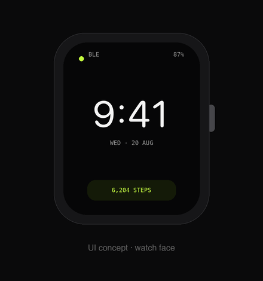

# OpenWrist

[](https://github.com/sharankumarreddyk/openwrist/actions/workflows/ci.yml)
[](LICENSE)

An open-source ESP32 smartwatch for iPhone. The watch pairs over Bluetooth LE
and reads notifications, calls, time, and music from iOS using Apple's built-in
BLE services — **no App Store, no paid developer account**. A companion iOS app
(sideloaded with a free Apple ID) adds Apple Health sync, weather, config, and
wireless firmware updates.

> **Status:** the hardware-independent parts are implemented and tested — the
> BLE protocol, the firmware's portable core (packet codec, TOTP, pedometer),
> and the companion iOS app (settings, weather, authenticator). On-device
> bring-up (display, sensors, the BLE stack) begins once a board is in hand.
> See [`docs/ROADMAP.md`](docs/ROADMAP.md).

<p align="center">
  
</p>
<p align="center"><sub><b>UI concept</b> — design mockup of the watch faces (time · ANCS notification · AMS music · steps). Not a firmware screenshot; on-device UI lands with hardware bring-up.</sub></p>

## Why it works

**Core features need no app** — iOS exposes three standard BLE services that any
bonded device may consume:

| Service | What the watch gets |
|---------|---------------------|
| **ANCS** | Every notification + incoming-call caller ID and actions |
| **CTS** | Wall-clock time, auto-synced (handles DST) |
| **AMS** | Now-playing track/artist + play/pause/skip control |

**Everything else via the companion app** — a self-signed iOS app bridges what
ANCS can't: step/HR data **into Apple Health** (HealthKit is app-only), weather
and config **down to the watch**, and **OTA firmware updates**.

## Features

Planned:
- 🔔 Notifications + caller ID (ANCS)
- 🕐 Auto time sync + watch faces (CTS), tap/tilt-to-wake
- 🎵 Music control (AMS)
- 👟 Step counting (IMU) → Apple Health via the app
- 🌤️ Weather + config from the companion app
- ⬆️ OTA updates over WiFi or BLE
- 🔋 Multi-day battery (no always-on)

Free extras (pure firmware, no added hardware):
- 📷 Camera-shutter remote (BLE HID) · 📵 find my phone · 🎞️ presenter remote
- 🔐 TOTP 2FA authenticator — offline codes (Microsoft/Google/GitHub/AWS in code mode)
- 🏃 Sleep tracking, fall detection, gesture controls (IMU)
- 🌐 World clock, tickers, smart-home remote (WiFi)
- 🧰 Timer, stopwatch, alarms, calculator, bubble level, flashlight, a game

Health sensing is deliberately *secondary* — the focus is the phone-companion
experience.

## Repository layout

```
openwrist/
├── app/          iOS companion app (SwiftUI · CoreBluetooth · HealthKit)
├── firmware/     ESP32 firmware — portable core/ (tested) + board layers (WIP)
├── docs/         protocol, architecture, hardware, research, roadmap
└── .github/      CI and contribution templates
```

## Quickstart

**Firmware core tests** (portable C, no ESP-IDF needed):
```bash
make -C firmware test
```

**iOS app** (macOS + Xcode):
```bash
brew install xcodegen
cd app && xcodegen && open OpenWrist.xcodeproj      # build & run in the simulator
```

**iOS app tests:**
```bash
cd app && xcodegen
xcodebuild -project OpenWrist.xcodeproj -scheme OpenWrist \
  -destination 'platform=iOS Simulator,name=iPhone 17' test CODE_SIGNING_ALLOWED=NO
```

## Hardware

Any ESP32-S3 watch board with a touch display, IMU, WiFi/BLE, and USB-C works —
the reference target is the LILYGO T-Watch S3 or the Waveshare
ESP32-S3-Touch-AMOLED-2.06. Board options, trade-offs, and the BOM are in
[`docs/HARDWARE.md`](docs/HARDWARE.md).

## Stack

- **Watch:** ESP-IDF + ESP-Brookesia + LVGL
- **App:** SwiftUI + CoreBluetooth + HealthKit

## Documentation

- [`docs/PROTOCOL.md`](docs/PROTOCOL.md) — the `ble_ow` BLE contract
- [`docs/ARCHITECTURE.md`](docs/ARCHITECTURE.md) — system, firmware, and app design
- [`docs/HARDWARE.md`](docs/HARDWARE.md) — board options and BOM
- [`docs/RESEARCH.md`](docs/RESEARCH.md) — prior art and design rationale
- [`docs/ROADMAP.md`](docs/ROADMAP.md) — milestones and status

## Contributing

Contributions welcome — see [`CONTRIBUTING.md`](CONTRIBUTING.md) and the
[code of conduct](CODE_OF_CONDUCT.md). Security reports:
[`SECURITY.md`](SECURITY.md).

## License

[MIT](LICENSE).
